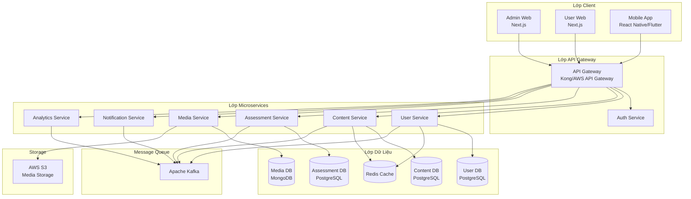
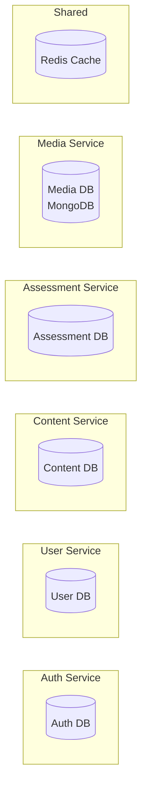

# KOJIRO 803 - Kiến Trúc Kỹ Thuật & Hướng Dẫn Triển Khai

> **Dự án:** Nền tảng Giáo dục KOJIRO 803  
> **Loại tài liệu:** Kiến Trúc Kỹ Thuật & Thiết Kế Backend  
> **Ngày tạo:** 27/01/2026  
> **Tác giả:** Đoàn Thành Chung (Backend Developer)

---

## 📋 Mục Lục

- [Tổng Quan](#tổng-quan)
- [Tổng Quan Kiến Trúc Hệ Thống](#tổng-quan-kiến-trúc-hệ-thống)
- [Thiết Kế Microservices](#thiết-kế-microservices)
- [Công Nghệ Backend](#công-nghệ-backend)
- [Kiến Trúc Cơ Sở Dữ Liệu](#kiến-trúc-cơ-sở-dữ-liệu)
- [Thiết Kế API](#thiết-kế-api)
- [Hạ Tầng & DevOps](#hạ-tầng--devops)
- [Kiến Trúc Bảo Mật](#kiến-trúc-bảo-mật)
- [Giám Sát & Quan Sát](#giám-sát--quan-sát)
- [Phù Hợp Với Lộ Trình Phát Triển Nghề Nghiệp](#phù-hợp-với-lộ-trình-phát-triển-nghề-nghiệp)

---

## 🎯 Tổng Quan

### Bối Cảnh Dự Án
KOJIRO 803 là nền tảng giáo dục toàn diện cho **học lý thuyết và luật lái xe** được thiết kế cho người dùng Nhật Bản chuẩn bị thi bằng lái xe. Nền tảng bao gồm Admin Web (Next.js 13, React 18, TypeScript), User Web, và Mobile App (React Native), yêu cầu kiến trúc backend mạnh mẽ, có khả năng mở rộng để hỗ trợ:

- **Hơn 15 module tính năng** (Quản lý Người dùng, Quản lý Nội dung, Hệ thống Đánh giá, v.v.)
- **Kiểm soát truy cập dựa trên vai trò** (Vai trò Admin, Teacher)
- **Quản lý nội dung phong phú** (Video hướng dẫn lái xe lên đến 5GB, Văn bản kỹ thuật số, Câu hỏi thực hành)
- **Thông báo thời gian thực** và phân tích
- **Tính sẵn sàng cao** và yêu cầu hiệu suất
- **Hơn 5.000 lượt tải ứng dụng** với lượng người dùng đang tăng trưởng

### Triết Lý Kiến Trúc
Tuân theo **kiến trúc microservices** với **mô hình hướng sự kiện**, **nguyên tắc DDD**, và **clean architecture** để đảm bảo:
- ✅ Khả năng mở rộng và bảo trì
- ✅ Triển khai và phát triển độc lập
- ✅ Linh hoạt về công nghệ
- ✅ Cô lập lỗi
- ✅ Phát triển kỹ năng nghề nghiệp (phù hợp với mục tiêu 2026)

### Tại Sao Microservices? Lý Do Kinh Doanh

> **Lý do cốt lõi**: Hệ thống phục vụ nhiều loại client (Admin Web, User Web, Mobile App) với **hơn 5.000 lượt tải ứng dụng** và lượng người dùng hoạt động đang tăng trưởng tạo ra các mô hình traffic thực tế. Điều này yêu cầu tách backend theo domain với API Gateway/BFF để: **(1)** kiểm soát phân quyền và payload cho từng client, **(2)** scale độc lập cho các workload nặng (media/notifications/assessments), và **(3)** triển khai/rollback an toàn mà không làm gián đoạn ứng dụng mobile.

#### 1. **Yêu Cầu Kiến Trúc Đa Client**

Nền tảng phục vụ **ba loại client khác nhau** với nhu cầu hoàn toàn khác biệt:

**Admin Web (管理者)**
- **Khối lượng công việc**: Các thao tác quản trị, quản lý nội dung luật lái xe, quản lý người dùng, thao tác hàng loạt, báo cáo
- **Quyền hạn**: Truy cập cấp cao nhất (hơn 15 module tính năng)
- **Nhu cầu API**: Truy vấn phức tạp, thao tác batch, xuất dữ liệu, quản lý nội dung
- **Hiệu suất**: Có thể chấp nhận độ trễ cao hơn cho các thao tác phức tạp

**User Web (一般ユーザー)**
- **Khối lượng công việc**: Trải nghiệm học lý thuyết lái xe đầy đủ, thi thử, tương tác UI phong phú
- **Quyền hạn**: Dựa trên vai trò (Teacher vs Student)
- **Nhu cầu API**: Các endpoint đa dạng cho bài tập luật lái xe, thi thử, thi thực hành, video hướng dẫn
- **Hiệu suất**: Kỳ vọng hiệu suất web tiêu chuẩn

**Mobile App (モバイル)**
- **Khối lượng công việc**: Học lý thuyết lái xe di động, luyện tập offline, push notifications nhắc nhở học tập
- **Quyền hạn**: Giống User Web nhưng có ràng buộc thiết bị
- **Nhu cầu API**: Payload tối ưu cho câu hỏi/video lái xe, độ trễ thấp, hỗ trợ versioning
- **Hiệu suất**: Quan trọng - phải xử lý mạng kém, ràng buộc pin, nội dung video lớn (lên đến 5GB)

**Vấn Đề Với Monolithic "Một API Cho Tất Cả":**

❌ **Rủi ro Bảo mật**: Endpoint admin và user chia sẻ DTO → nguy cơ rò rỉ dữ liệu  
❌ **Hiệu suất**: Không thể tối ưu riêng cho mobile (kích thước payload, độ trễ)  
❌ **Versioning Hell**: Ứng dụng mobile cập nhật chậm → thay đổi API phá vỡ phiên bản cũ  
❌ **Blast Radius**: Truy vấn nặng của admin có thể ảnh hưởng trải nghiệm người dùng mobile  

**Giải Pháp Microservices + API Gateway/BFF:**

✅ **Luồng Traffic Riêng Biệt**: Admin/User/Mobile định tuyến qua các chính sách khác nhau  
✅ **Response Tối Ưu**: Mobile nhận DTO nhẹ, web nhận dữ liệu phong phú  
✅ **Quản Lý Phiên Bản**: Gateway xử lý API versioning cho khả năng tương thích ngược  
✅ **Cô Lập**: Thao tác admin không ảnh hưởng hiệu suất mobile  
✅ **Bảo Mật**: Kiểm soát truy cập chi tiết cho từng loại client  

#### 2. **Mô Hình Traffic Thực Tế Với Hơn 5.000 Lượt Tải Ứng Dụng**

Với **hơn 5.000 lượt tải ứng dụng** và lượng người dùng hoạt động đang tăng trưởng, hệ thống đối mặt với **các thách thức production thực tế**:

**Các Kịch Bản Traffic Cao Điểm:**
- 📚 **Giờ Học**: 7-9 PM các ngày trong tuần → 60-70% người dùng đồng thời
- 📝 **Kỳ Thi**: Thi thử → hơn 1.000 người thi cùng lúc
- 📱 **Push Notifications**: Thông báo hàng loạt → 5.000 kết nối đồng thời
- 🎥 **Video Streaming**: Video PR (5GB) → tải IO/băng thông cực lớn
- 📊 **Tạo Báo Cáo**: Xuất tỷ lệ chính xác của admin → truy vấn DB nặng

**Đặc Điểm Workload (Không Đồng Nhất):**

| Service | Mô Hình Traffic | Loại Tài Nguyên | Yêu Cầu Scale |
|---------|----------------|---------------|---------------|
| **Assessment** | Burst (giờ thi) | CPU + Cache | Horizontal scale |
| **Media** | Heavy IO | Network + Storage | Vertical + CDN |
| **Notification** | Spike (broadcast) | Connections | Queue-based |
| **Analytics** | Background | Read-heavy DB | Separate read replica |
| **User/Auth** | Steady | Memory + Cache | Moderate scale |

**Tại Sao Microservices Cho Quy Mô Này:**

✅ **Scale Độc Lập**: Scale Media service cho tải video mà không cần scale Auth  
✅ **Tối Ưu Tài Nguyên**: Phân bổ CPU cho Assessment, IO cho Media, Memory cho Cache  
✅ **Bảo Vệ SLA**: Giữ các service cốt lõi (Auth, User) phản hồi nhanh trong lúc Media peak  
✅ **Hiệu Quả Chi Phí**: Trả tiền cho tài nguyên nơi cần thiết, không over-provisioning đồng đều  
✅ **Cô Lập Hiệu Suất**: Truy vấn analytics không làm chậm đánh giá thời gian thực  

**Ví Dụ Chiến Lược Scaling:**
```yaml
Tải Bình Thường (off-peak):
  - Auth Service: 2 instances
  - User Service: 2 instances
  - Assessment Service: 2 instances
  - Media Service: 1 instance
  - Notification Service: 1 instance

Tải Cao Điểm (giờ thi, 7-9 PM):
  - Auth Service: 3 instances (↑50%)
  - User Service: 3 instances (↑50%)
  - Assessment Service: 6 instances (↑200%) ← scale nhiều nhất
  - Media Service: 2 instances (↑100%)
  - Notification Service: 3 instances (↑200%)

Đỉnh Upload Video:
  - Media Service: 5 instances (↑400%)
  - Các service khác: không đổi ← tiết kiệm chi phí
```

#### 3. **An Toàn Vận Hành Với Nhiều Client**

**Thách Thức Ứng Dụng Mobile:**
- Người dùng cập nhật app chậm → 3-5 phiên bản trong production đồng thời
- App Store review mất 1-3 ngày → không thể hotfix ngay lập tức
- Thay đổi API breaking → hàng nghìn người dùng bị ảnh hưởng ngay lập tức

**Rủi Ro Triển Khai Monolithic:**

❌ **All-or-Nothing**: Một bug trong analytics phá vỡ toàn bộ app  
❌ **Rollback Chậm**: Hoàn tác monolith mất 15-30 phút  
❌ **Rủi Ro Cao**: Mỗi lần triển khai đều rủi ro cho tất cả người dùng  
❌ **Độ Phức Tạp Test**: Phải test toàn bộ hệ thống cho thay đổi nhỏ  

**Lợi Ích Triển Khai Microservices:**

✅ **Triển Khai Độc Lập**: Cập nhật Analytics mà không chạm vào Assessment  
✅ **Rollback Nhanh**: Hoàn tác single service trong < 2 phút  
✅ **Canary Releases**: Test phiên bản mới với 5% người dùng trước  
✅ **Blue-Green Deployment**: Triển khai zero-downtime cho từng service  
✅ **API Versioning**: Gateway định tuyến phiên bản mobile cũ đến v1, mới đến v2  

**Kịch Bản Thực Tế:**
```
Kịch bản: Bug trong tính toán độ chính xác của Analytics Service

Phản Ứng Monolithic:
1. Xác định bug trong module analytics
2. Sửa + test toàn bộ ứng dụng (2-4 giờ)
3. Triển khai toàn bộ monolith (30 phút)
4. Rủi ro: Triển khai có thể phá vỡ các tính năng khác
5. Nếu cần rollback: 30 phút + tất cả người dùng bị ảnh hưởng

Phản Ứng Microservices:
1. Xác định bug trong Analytics Service
2. Sửa + test chỉ Analytics (1 giờ)
3. Triển khai chỉ Analytics Service (5 phút)
4. Rủi ro: Cô lập trong các tính năng analytics
5. Nếu cần rollback: 2 phút + chỉ analytics bị ảnh hưởng
```

#### 4. **Linh Hoạt Công Nghệ Cho Nhu Cầu Chuyên Biệt**

Các domain khác nhau có công nghệ tối ưu khác nhau:

| Domain | Công Nghệ Tốt Nhất | Lý Do |
|--------|-------------------|-------|
| **Auth/User** | Spring Boot (Java) | Bảo mật doanh nghiệp, hệ sinh thái trưởng thành |
| **Content/Media** | NestJS (TypeScript) | Async I/O, streaming video lái xe lớn (lên đến 5GB), real-time |
| **Assessment** | Spring Boot (Java) | Xử lý transaction, logic quiz phức tạp, chấm điểm thi |
| **Analytics** | Python (tùy chọn) | Thư viện ML, theo dõi hiệu suất, phân tích độ chính xác |
| **Notification** | NestJS (TypeScript) | WebSocket, event-driven, nhắc nhở học tập |

**Ràng Buộc Monolith**: Phải dùng một stack cho mọi thứ  
**Tự Do Microservices**: Chọn công cụ tốt nhất cho từng công việc

---

## 🏗️ Tổng Quan Kiến Trúc Hệ Thống

### Kiến Trúc Cấp Cao



### Các Mô Hình Kiến Trúc

| Mô Hình | Mục Đích | Triển Khai | Tại Sao Cho KOJIRO |
|---------|---------|-----------|-------------------|
| **Microservices** | Phân tách service | Ranh giới theo domain | Scale độc lập cho 5.000+ người dùng |
| **BFF (Backend for Frontend)** | API tối ưu cho client | Route riêng cho từng client | Admin/User/Mobile có nhu cầu khác nhau |
| **Event-Driven** | Giao tiếp bất đồng bộ | Kafka message broker | Tách rời services, xử lý burst |
| **CQRS** | Tách Read/Write | Analytics & reporting | Tối ưu truy vấn read nặng |
| **API Gateway** | Điểm vào duy nhất | Kong/AWS API Gateway | Versioning, rate limiting, auth |
| **Clean Architecture** | Đảo ngược phụ thuộc | Hexagonal architecture | Khả năng test, bảo trì |
| **DDD** | Mô hình hóa domain | Bounded contexts | Căn chỉnh với domain nghiệp vụ |
| **Database per Service** | Cô lập dữ liệu | PostgreSQL cho mỗi service | Scale độc lập, không có DB bottleneck chung |

---

## 🔧 Thiết Kế Microservices

### Phân Tách Service

#### 1. **Authentication & Authorization Service**
**Trách nhiệm:** Xác thực người dùng, quản lý JWT token, RBAC

**Tech Stack:**
- **Framework:** Spring Boot 3.2 (Java 17)
- **Security:** Spring Security + JWT
- **Database:** PostgreSQL (thông tin đăng nhập, roles, permissions)
- **Cache:** Redis (token blacklist, session cache)

**Tính Năng Chính:**
- Đăng nhập/Đăng xuất với JWT
- Kiểm soát truy cập dựa trên vai trò (Admin, Teacher)
- Cơ chế refresh token
- Mã hóa mật khẩu (BCrypt)
- Tích hợp OAuth2 (tương lai)

**API Endpoints:**
```
POST   /api/v1/auth/login
POST   /api/v1/auth/logout
POST   /api/v1/auth/refresh
POST   /api/v1/auth/verify-token
GET    /api/v1/auth/me
```

**Database Schema:**
```sql
-- Bảng users
CREATE TABLE users (
    id BIGSERIAL PRIMARY KEY,
    email VARCHAR(255) UNIQUE NOT NULL,
    password_hash VARCHAR(255) NOT NULL,
    role_id INTEGER NOT NULL,
    is_active BOOLEAN DEFAULT true,
    created_at TIMESTAMP DEFAULT CURRENT_TIMESTAMP,
    updated_at TIMESTAMP DEFAULT CURRENT_TIMESTAMP
);

-- Bảng roles
CREATE TABLE roles (
    id SERIAL PRIMARY KEY,
    name VARCHAR(50) UNIQUE NOT NULL,
    description TEXT
);

-- Bảng permissions
CREATE TABLE permissions (
    id SERIAL PRIMARY KEY,
    role_id INTEGER REFERENCES roles(id),
    resource VARCHAR(100) NOT NULL,
    action VARCHAR(50) NOT NULL,
    UNIQUE(role_id, resource, action)
);
```

---

#### 2. **User Management Service**
**Trách nhiệm:** CRUD người dùng, quản lý hồ sơ, thao tác hàng loạt

**Tech Stack:**
- **Framework:** Spring Boot 3.2 (Java 17)
- **ORM:** Spring Data JPA + Hibernate
- **Database:** PostgreSQL
- **Cache:** Redis (hồ sơ người dùng)
- **Messaging:** Kafka (sự kiện người dùng)

**Tính Năng Chính:**
- Thao tác CRUD người dùng
- Upload người dùng hàng loạt (phân tích CSV/Excel)
- Lọc và tìm kiếm người dùng
- Quản lý gói (video plans, proficiency test flags)
- Quản lý trạng thái người dùng

**API Endpoints:**
```
GET    /api/v1/users?page=1&size=20&filters=...
POST   /api/v1/users
GET    /api/v1/users/{id}
PUT    /api/v1/users/{id}
DELETE /api/v1/users/{id}
POST   /api/v1/users/bulk-upload
GET    /api/v1/users/export
```

**Events Published:**
- `UserCreated` (Người dùng được tạo)
- `UserUpdated` (Người dùng được cập nhật)
- `UserDeleted` (Người dùng bị xóa)
- `UserBulkUploaded` (Upload hàng loạt người dùng)

---

#### 3. **Content Management Service**
**Trách nhiệm:** Danh mục luật lái xe, văn bản kỹ thuật số, luật giao thông, bảng kiến thức

**Tech Stack:**
- **Framework:** NestJS (TypeScript)
- **ORM:** Prisma
- **Database:** PostgreSQL
- **Cache:** Redis
- **Search:** Elasticsearch (tùy chọn)

**Tính Năng Chính:**
- Quản lý danh mục chủ đề lái xe (cấu trúc phân cấp)
- Quản lý văn bản kỹ thuật số (sách hướng dẫn lái xe, tài liệu luật)
- Quản lý tài liệu luật giao thông
- Bảng kiến thức cho cộng đồng hỏi đáp về lái xe
- Nội dung rich text (lưu trữ HTML)

**API Endpoints:**
```
# Danh mục
GET    /api/v1/categories
POST   /api/v1/categories
PUT    /api/v1/categories/{id}
DELETE /api/v1/categories/{id}

# Văn bản kỹ thuật số
GET    /api/v1/digital-texts
POST   /api/v1/digital-texts
PUT    /api/v1/digital-texts/{id}
DELETE /api/v1/digital-texts/{id}

# Bảng kiến thức
GET    /api/v1/knowledge-boards
POST   /api/v1/knowledge-boards
PUT    /api/v1/knowledge-boards/{id}
DELETE /api/v1/knowledge-boards/{id}
```

---

#### 4. **Assessment Service**
**Trách nhiệm:** Bài tập lý thuyết lái xe, câu hỏi thực hành, thi thử, kiểm tra năng lực

**Tech Stack:**
- **Framework:** Spring Boot 3.2 (Java 17)
- **ORM:** Spring Data JPA + Hibernate
- **Database:** PostgreSQL
- **Cache:** Redis (cache câu hỏi)
- **Messaging:** Kafka (sự kiện đánh giá)

**Tính Năng Chính:**
- Quản lý bài tập lý thuyết lái xe (練習問題)
- Ngân hàng câu hỏi luật lái xe (実践問題)
- Cấu hình thi thử lái xe (模擬試験)
- Quản lý kiểm tra năng lực lái xe (実力診断テスト)
- Phân loại câu hỏi theo chủ đề lái xe và mức độ khó
- Import câu hỏi lý thuyết lái xe hàng loạt

**API Endpoints:**
```
# Bài tập
GET    /api/v1/exercises
POST   /api/v1/exercises
POST   /api/v1/exercises/bulk-upload
PUT    /api/v1/exercises/{id}
DELETE /api/v1/exercises/{id}

# Thi thử
GET    /api/v1/exams
POST   /api/v1/exams
PUT    /api/v1/exams/{id}/settings
POST   /api/v1/exams/{id}/questions
DELETE /api/v1/exams/{id}

# Kiểm tra năng lực
GET    /api/v1/proficiency-tests
POST   /api/v1/proficiency-tests
PUT    /api/v1/proficiency-tests/{id}
GET    /api/v1/proficiency-tests/{id}/results
```

**Events Published:**
- `ExerciseCreated` (Bài tập được tạo)
- `ExamCompleted` (Hoàn thành thi)
- `ProficiencyTestSubmitted` (Nộp kiểm tra năng lực)

---

#### 5. **Media Service**
**Trách nhiệm:** Quản lý video hướng dẫn lái xe, upload file, xử lý media

**Tech Stack:**
- **Framework:** NestJS (TypeScript)
- **Database:** MongoDB (metadata)
- **Storage:** AWS S3
- **Processing:** AWS Lambda (video transcoding)
- **CDN:** CloudFront

**Tính Năng Chính:**
- Upload video hướng dẫn lái xe (thường: 5MB, PR: 5GB)
- Upload file cho câu hỏi lái xe, giải thích, sơ đồ
- Tối ưu hình ảnh cho biển báo giao thông và tình huống đường bộ
- Transcoding video nội dung hướng dẫn lái xe
- Tạo presigned URL
- Hỗ trợ streaming cho video lái xe lớn

**API Endpoints:**
```
POST   /api/v1/media/videos/upload
GET    /api/v1/media/videos/{id}
DELETE /api/v1/media/videos/{id}
POST   /api/v1/media/images/upload
GET    /api/v1/media/presigned-url
```

---

#### 6. **Notification Service**
**Trách nhiệm:** Thông báo hệ thống, thông báo người dùng, email/push notifications

**Tech Stack:**
- **Framework:** NestJS (TypeScript)
- **Database:** PostgreSQL
- **Queue:** RabbitMQ (hàng đợi thông báo)
- **Email:** AWS SES
- **Push:** Firebase Cloud Messaging (tương lai)

**Tính Năng Chính:**
- Thông báo toàn hệ thống (bảo trì, cập nhật luật lái xe mới)
- Thông báo người dùng cụ thể (nhắc nhở học tập, lịch thi)
- Thông báo email
- Theo dõi trạng thái đã đọc/chưa đọc
- Lên lịch thông báo cho kế hoạch học tập

**API Endpoints:**
```
GET    /api/v1/notifications?userId={id}
POST   /api/v1/notifications
PUT    /api/v1/notifications/{id}/read
DELETE /api/v1/notifications/{id}
GET    /api/v1/notifications/unread-count
```

**Event Consumers:**
- `UserCreated` → Gửi email chào mừng
- `ExamCompleted` → Gửi thông báo hoàn thành
- `SystemMaintenance` → Gửi cảnh báo bảo trì

---

#### 7. **Analytics Service**
**Trách nhiệm:** Tỷ lệ chính xác, số liệu hiệu suất, báo cáo

**Tech Stack:**
- **Framework:** Spring Boot 3.2 (Java 17)
- **Database:** PostgreSQL (write), Elasticsearch (read)
- **Pattern:** CQRS
- **Reporting:** Apache POI (xuất Excel)

**Tính Năng Chính:**
- Tính toán tỷ lệ chính xác cho câu hỏi lý thuyết lái xe
- Theo dõi hiệu suất người dùng trong chuẩn bị thi lái xe
- Xuất ra Excel/CSV cho phân tích thi lái xe
- Dashboard phân tích thời gian thực cho tiến độ học tập
- Phân tích xu hướng lịch sử cho việc thành thạo lý thuyết lái xe

**API Endpoints:**
```
GET    /api/v1/analytics/accuracy-rate?questionId={id}
GET    /api/v1/analytics/user-performance/{userId}
GET    /api/v1/analytics/export?format=excel
GET    /api/v1/analytics/dashboard
```

**Triển Khai CQRS:**
```java
// Write Model
@Service
public class AnswerCommandService {
    public void recordAnswer(RecordAnswerCommand cmd) {
        // Lưu vào PostgreSQL
        answerRepository.save(answer);
        
        // Publish event
        eventPublisher.publish(new AnswerRecorded(answer));
    }
}

// Read Model
@Service
public class AnalyticsQueryService {
    public AccuracyRate getAccuracyRate(Long questionId) {
        // Truy vấn từ Elasticsearch
        return elasticsearchRepository.findAccuracyRate(questionId);
    }
}

// Event Handler
@EventHandler
public class AnalyticsProjection {
    public void on(AnswerRecorded event) {
        // Cập nhật Elasticsearch
        updateAccuracyRateProjection(event);
    }
}
```

---

## 💻 Công Nghệ Backend

### Stack Được Đề Xuất (Phù Hợp Với Mục Tiêu Nghề Nghiệp)

#### **Framework Backend Chính**
```yaml
Ngôn ngữ: Java 17
Framework: Spring Boot 3.2
Lý do: 
  - Chuyên môn hiện tại (kinh nghiệm dự án YD)
  - Cấp doanh nghiệp, sẵn sàng production
  - Xuất sắc cho microservices
  - Hệ sinh thái mạnh (Spring Cloud, Spring Security)
  - Phù hợp với lộ trình nghề nghiệp
```

#### **Framework Backend Phụ**
```yaml
Ngôn ngữ: TypeScript
Framework: NestJS
Lý do:
  - Hiện đại, TypeScript-first
  - Xuất sắc cho Node.js microservices
  - Dependency injection tích hợp sẵn
  - Tuyệt vời cho tính năng real-time
  - Mở rộng kỹ năng nghề nghiệp
```

#### **ORM/ODM**
```yaml
Java Services:
  - Spring Data JPA + Hibernate
  - Flyway (database migrations)

Node.js Services:
  - Prisma (PostgreSQL)
  - Mongoose (MongoDB)
```

#### **Databases**
```yaml
Chính: PostgreSQL 15
  - Dữ liệu người dùng, nội dung, đánh giá
  - Tuân thủ ACID
  - Hỗ trợ JSON cho schema linh hoạt

Phụ: MongoDB
  - Metadata media
  - Logs và analytics
  - Schema linh hoạt

Cache: Redis
  - Lưu trữ session
  - Cache kết quả truy vấn
  - Rate limiting
```

#### **Message Broker**
```yaml
Apache Kafka:
  - Kiến trúc hướng sự kiện
  - Throughput cao
  - Event sourcing
  - Giao tiếp microservice

RabbitMQ:
  - Hàng đợi thông báo
  - Hàng đợi task
  - Các trường hợp đơn giản hơn
```

#### **API Gateway**
```yaml
Tùy chọn:
  1. Kong (được đề xuất)
     - Open source
     - Hệ sinh thái plugin
     - Rate limiting, auth
  
  2. AWS API Gateway
     - Dịch vụ được quản lý
     - Tích hợp AWS
     - Auto-scaling
```

---

## 🗄️ Kiến Trúc Cơ Sở Dữ Liệu

### Mô Hình Database-per-Service



### Chiến Lược Đảm Bảo Tính Nhất Quán Dữ Liệu

#### **Saga Pattern Cho Distributed Transactions**
```java
// Ví dụ: User Registration Saga
@Service
public class UserRegistrationSaga {
    
    @Transactional
    public void createUser(CreateUserCommand cmd) {
        // Bước 1: Tạo user trong User Service
        User user = userRepository.save(new User(cmd));
        
        // Bước 2: Publish event
        eventPublisher.publish(new UserCreated(user.getId(), user.getEmail()));
    }
    
    @EventHandler
    public void onUserCreated(UserCreated event) {
        try {
            // Bước 3: Tạo thông tin đăng nhập
            authService.createCredentials(event.getUserId(), event.getEmail());
            
            // Bước 4: Gửi email chào mừng
            notificationService.sendWelcomeEmail(event.getEmail());
            
        } catch (Exception e) {
            // Compensating transaction
            userRepository.deleteById(event.getUserId());
            throw e;
        }
    }
}
```

#### **Outbox Pattern Cho Event Publishing Đáng Tin Cậy**
```java
@Entity
@Table(name = "outbox_events")
public class OutboxEvent {
    @Id
    @GeneratedValue(strategy = GenerationType.IDENTITY)
    private Long id;
    
    private String aggregateType;
    private String aggregateId;
    private String eventType;
    
    @Column(columnDefinition = "jsonb")
    private String payload;
    
    private Boolean published = false;
    private LocalDateTime createdAt;
}

@Service
public class OutboxPublisher {
    
    @Scheduled(fixedDelay = 5000) // Mỗi 5 giây
    public void publishPendingEvents() {
        List<OutboxEvent> events = outboxRepository.findByPublishedFalse();
        
        for (OutboxEvent event : events) {
            try {
                kafkaTemplate.send(event.getEventType(), event.getPayload());
                event.setPublished(true);
                outboxRepository.save(event);
            } catch (Exception e) {
                log.error("Failed to publish event: {}", event.getId(), e);
            }
        }
    }
}
```

---

*[Tài liệu tiếp tục với các phần: Thiết Kế API, Hạ Tầng & DevOps, Bảo Mật, Giám Sát, và Phát Triển Nghề Nghiệp...]*

**Trạng Thái Tài Liệu:** Bản nháp để xem xét  
**Cập nhật lần cuối:** 28/01/2026  
**Xem xét tiếp theo:** Sau phản hồi từ stakeholder

---

*Kiến trúc này được thiết kế để triển khai từng bước, cho phép học hỏi và lặp lại trong khi xây dựng các kỹ năng sẵn sàng cho production phù hợp với mục tiêu nghề nghiệp 2026 của bạn.*
