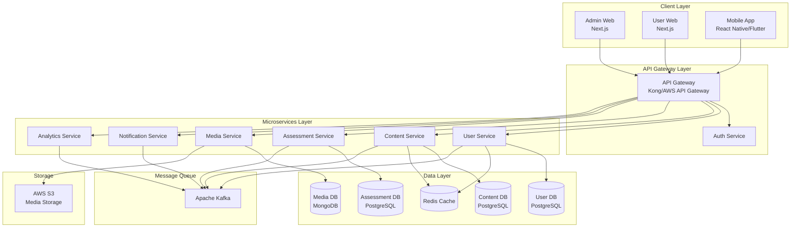
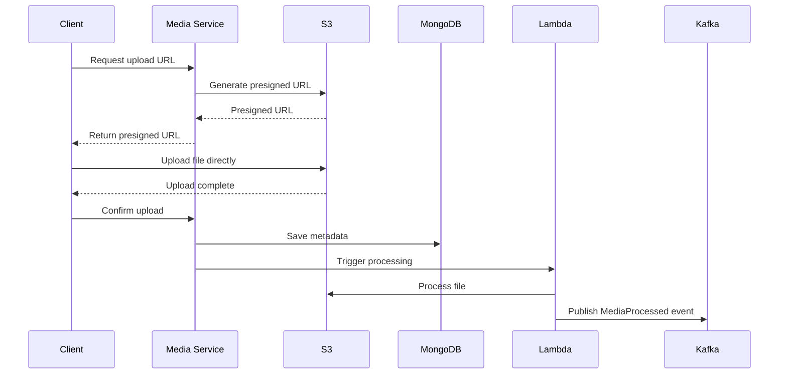
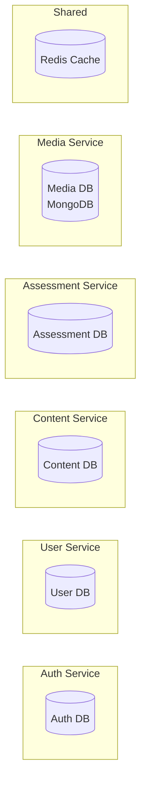
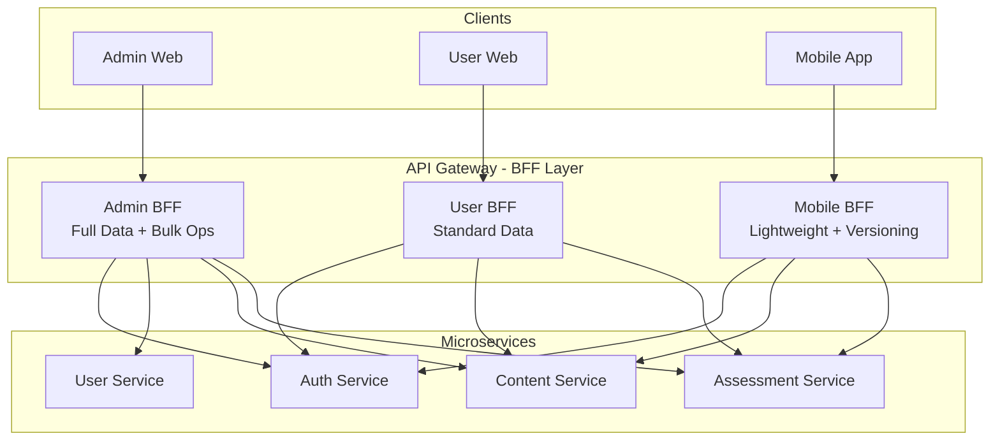
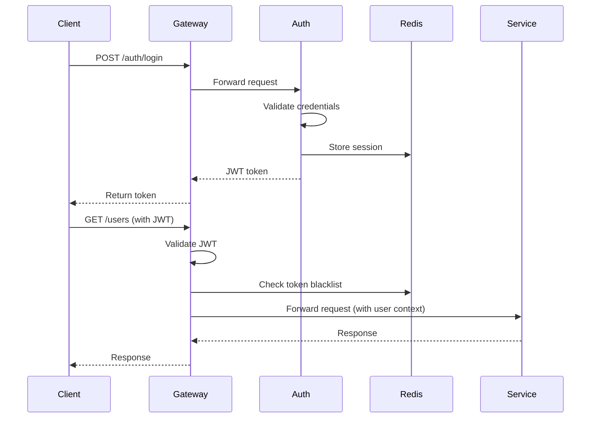
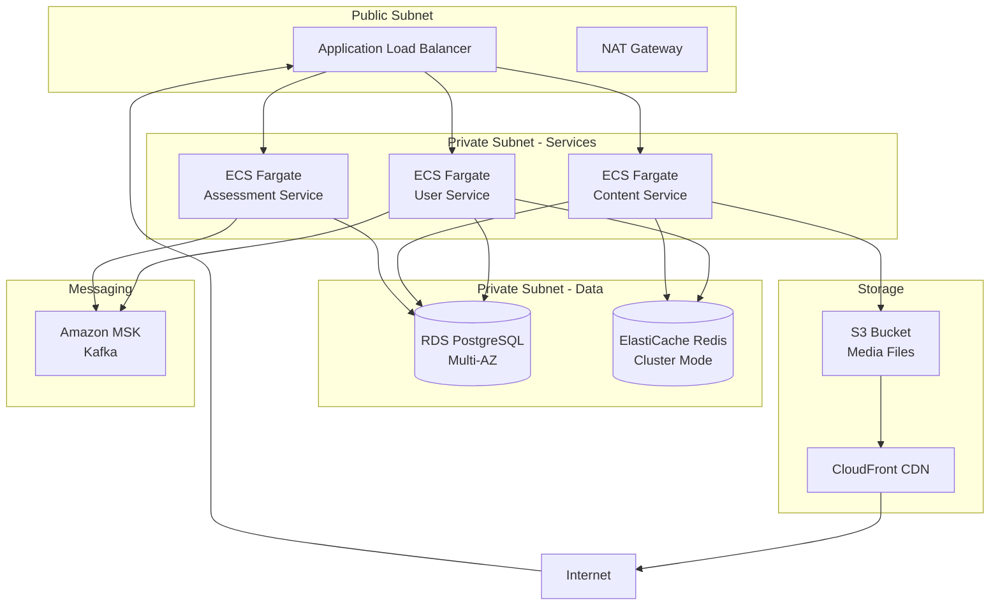
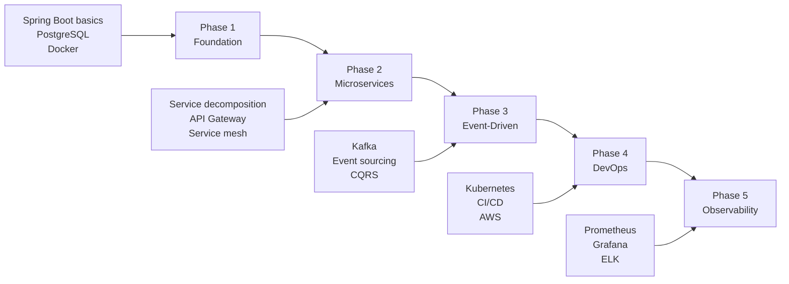

# KOJIRO 803 - Technical Architecture & Implementation Guide

> **Project:** KOJIRO 803 Educational Platform  
> **Document Type:** Technical Architecture & Backend Design  
> **Created:** 2026-01-27  
> **Author:** Đoàn Thành Chung (Backend Developer)

---

## 📋 Table of Contents

- [Executive Summary](#executive-summary)
- [System Architecture Overview](#system-architecture-overview)
- [Microservices Design](#microservices-design)
- [Backend Technology Stack](#backend-technology-stack)
- [Database Architecture](#database-architecture)
- [API Design](#api-design)
- [Infrastructure & DevOps](#infrastructure--devops)
- [Security Architecture](#security-architecture)
- [Monitoring & Observability](#monitoring--observability)
- [Career Development Alignment](#career-development-alignment)

---

## 🎯 Executive Summary

### Project Context
KOJIRO 803 is a comprehensive educational platform for **driving theory and law learning** designed for Japanese users preparing for driving license exams. The platform includes Admin Web (Next.js 13, React 18, TypeScript), User Web, and Mobile App (React Native), requiring a robust, scalable backend architecture to support:

- **15+ feature modules** (User Management, Content Management, Assessment System, etc.)
- **Role-based access control** (Admin, Teacher roles)
- **Rich content management** (Videos up to 5GB for driving instruction, Digital texts, Practice questions)
- **Real-time notifications** and analytics
- **High availability** and performance requirements
- **5,000+ app downloads** with growing user base

### Architecture Philosophy
Following **microservices architecture** with **event-driven patterns**, **DDD principles**, and **clean architecture** to ensure:
- ✅ Scalability and maintainability
- ✅ Independent deployment and development
- ✅ Technology flexibility
- ✅ Fault isolation
- ✅ Career skill development (aligns with 2026 goals)

### Why Microservices? The Business Case

> **Core Justification**: The system serves multiple client types (Admin Web, User Web, Mobile App) with **5,000+ app downloads** and growing active user base creating real traffic patterns. This requires domain-based backend separation with API Gateway/BFF to: **(1)** control authorization and payload per client, **(2)** scale independently for heavy workloads (media/notifications/assessments), and **(3)** deploy/rollback safely without disrupting the mobile app.

#### 1. **Multi-Client Architecture Requirements**

The platform serves **three distinct client types** with fundamentally different needs:

**Admin Web (管理者)**
- **Workload**: Administrative operations, managing driving law content, user management, bulk operations, reporting
- **Permissions**: Highest level access (15+ feature modules)
- **API Needs**: Complex queries, batch operations, data export, content management
- **Performance**: Can tolerate higher latency for complex operations

**User Web (一般ユーザー)**
- **Workload**: Full driving theory learning experience, practice tests, rich UI interactions
- **Permissions**: Role-based (Teacher vs Student)
- **API Needs**: Diverse endpoints for driving law exercises, mock exams, practice tests, video tutorials
- **Performance**: Standard web performance expectations

**Mobile App (モバイル)**
- **Workload**: On-the-go driving theory learning, offline practice, push notifications for study reminders
- **Permissions**: Same as User Web but with device-specific constraints
- **API Needs**: Optimized payloads for driving questions/videos, low latency, versioning support
- **Performance**: Critical - must handle poor network, battery constraints, large video content (up to 5GB)

**Problems with Monolithic "One API for All":**

❌ **Security Risk**: Admin and user endpoints share DTOs → data leakage risk  
❌ **Performance**: Cannot optimize separately for mobile (payload size, latency)  
❌ **Versioning Hell**: Mobile app updates slowly → API changes break old versions  
❌ **Blast Radius**: Admin heavy queries can impact mobile user experience  

**Microservices + API Gateway/BFF Solution:**

✅ **Separate Traffic Flows**: Admin/User/Mobile routes through different policies  
✅ **Optimized Responses**: Mobile gets lightweight DTOs, web gets rich data  
✅ **Version Management**: Gateway handles API versioning for backward compatibility  
✅ **Isolation**: Admin operations don't affect mobile performance  
✅ **Security**: Fine-grained access control per client type  

#### 2. **Real Traffic Patterns with 5,000+ App Downloads**

With **5,000+ app downloads** and a growing active user base, the system faces **real production challenges**:

**Peak Traffic Scenarios:**
- 📚 **Study Hours**: 7-9 PM weekdays → 60-70% concurrent users
- 📝 **Exam Periods**: Mock exams → 1,000+ simultaneous test takers
- 📱 **Push Notifications**: Batch notifications → 5,000 concurrent connections
- � **Video Streaming**: PR videos (5GB) → extreme IO/bandwidth load
- 📊 **Report Generation**: Admin accuracy rate exports → heavy DB queries

**Workload Characteristics (Non-Uniform):**

| Service | Traffic Pattern | Resource Type | Scale Requirement |
|---------|----------------|---------------|-------------------|
| **Assessment** | Burst (exam time) | CPU + Cache | Horizontal scale |
| **Media** | Heavy IO | Network + Storage | Vertical + CDN |
| **Notification** | Spike (broadcast) | Connections | Queue-based |
| **Analytics** | Background | Read-heavy DB | Separate read replica |
| **User/Auth** | Steady | Memory + Cache | Moderate scale |

**Why Microservices for This Scale:**

✅ **Independent Scaling**: Scale Media service for video load without scaling Auth  
✅ **Resource Optimization**: Allocate CPU to Assessment, IO to Media, Memory to Cache  
✅ **SLA Protection**: Keep core services (Auth, User) responsive during Media peaks  
✅ **Cost Efficiency**: Pay for resources where needed, not uniform over-provisioning  
✅ **Performance Isolation**: Analytics queries don't slow down real-time assessments  

**Example Scaling Strategy:**
```yaml
Normal Load (off-peak):
  - Auth Service: 2 instances
  - User Service: 2 instances
  - Assessment Service: 2 instances
  - Media Service: 1 instance
  - Notification Service: 1 instance

Peak Load (exam time, 7-9 PM):
  - Auth Service: 3 instances (↑50%)
  - User Service: 3 instances (↑50%)
  - Assessment Service: 6 instances (↑200%) ← scales most
  - Media Service: 2 instances (↑100%)
  - Notification Service: 3 instances (↑200%)

Video Upload Spike:
  - Media Service: 5 instances (↑400%)
  - Other services: unchanged ← cost savings
```

#### 3. **Operational Safety with Multiple Clients**

**The Mobile App Challenge:**
- Users update apps slowly → 3-5 versions in production simultaneously
- App Store review takes 1-3 days → cannot hotfix instantly
- Breaking API changes → thousands of users affected immediately

**Monolithic Deployment Risks:**

❌ **All-or-Nothing**: One bug in analytics breaks entire app  
❌ **Slow Rollback**: Reverting monolith takes 15-30 minutes  
❌ **High Risk**: Every deployment risks all users  
❌ **Testing Complexity**: Must test entire system for small changes  

**Microservices Deployment Benefits:**

✅ **Independent Deployment**: Update Analytics without touching Assessment  
✅ **Fast Rollback**: Revert single service in < 2 minutes  
✅ **Canary Releases**: Test new version with 5% users first  
✅ **Blue-Green Deployment**: Zero-downtime deployments per service  
✅ **API Versioning**: Gateway routes old mobile versions to v1, new to v2  

**Real-World Scenario:**
```
Scenario: Bug in Analytics Service accuracy calculation

Monolithic Response:
1. Identify bug in analytics module
2. Fix + test entire application (2-4 hours)
3. Deploy entire monolith (30 min)
4. Risk: Deployment might break other features
5. If rollback needed: 30 min + all users affected

Microservices Response:
1. Identify bug in Analytics Service
2. Fix + test only Analytics (1 hour)
3. Deploy only Analytics Service (5 min)
4. Risk: Isolated to analytics features
5. If rollback needed: 2 min + only analytics affected
```

#### 4. **Technology Flexibility for Specialized Needs**

Different domains have different optimal technologies:

| Domain | Best Technology | Why |
|--------|----------------|-----|
| **Auth/User** | Spring Boot (Java) | Enterprise security, mature ecosystem |
| **Content/Media** | NestJS (TypeScript) | Async I/O, streaming large driving videos (up to 5GB), real-time |
| **Assessment** | Spring Boot (Java) | Transaction handling, complex quiz logic, exam scoring |
| **Analytics** | Python (optional) | ML libraries, performance tracking, accuracy analysis |
| **Notification** | NestJS (TypeScript) | WebSocket, event-driven, study reminders |

**Monolith Constraint**: Must use one stack for everything  
**Microservices Freedom**: Choose best tool for each job

---

## �🏗️ System Architecture Overview

### High-Level Architecture



### Architecture Patterns

| Pattern | Purpose | Implementation | Why for KOJIRO |
|---------|---------|----------------|----------------|
| **Microservices** | Service decomposition | Domain-driven boundaries | Independent scaling for 5,000+ users |
| **BFF (Backend for Frontend)** | Client-optimized APIs | Separate routes per client | Admin/User/Mobile have different needs |
| **Event-Driven** | Async communication | Kafka message broker | Decouple services, handle bursts |
| **CQRS** | Read/Write separation | Analytics & reporting | Optimize heavy read queries |
| **API Gateway** | Single entry point | Kong/AWS API Gateway | Versioning, rate limiting, auth |
| **Clean Architecture** | Dependency inversion | Hexagonal architecture | Testability, maintainability |
| **DDD** | Domain modeling | Bounded contexts | Align with business domains |
| **Database per Service** | Data isolation | PostgreSQL per service | Independent scaling, no shared DB bottleneck |

---

## 🔧 Microservices Design

### Service Breakdown

#### 1. **Authentication & Authorization Service**
**Responsibility:** User authentication, JWT token management, RBAC

**Tech Stack:**
- **Framework:** Spring Boot 3.2 (Java 17)
- **Security:** Spring Security + JWT
- **Database:** PostgreSQL (user credentials, roles, permissions)
- **Cache:** Redis (token blacklist, session cache)

**Key Features:**
- Login/Logout with JWT
- Role-based access control (Admin, Teacher)
- Token refresh mechanism
- Password encryption (BCrypt)
- OAuth2 integration (future)

**API Endpoints:**
```
POST   /api/v1/auth/login
POST   /api/v1/auth/logout
POST   /api/v1/auth/refresh
POST   /api/v1/auth/verify-token
GET    /api/v1/auth/me
```

**Database Schema:**
```sql
-- users table
CREATE TABLE users (
    id BIGSERIAL PRIMARY KEY,
    email VARCHAR(255) UNIQUE NOT NULL,
    password_hash VARCHAR(255) NOT NULL,
    role_id INTEGER NOT NULL,
    is_active BOOLEAN DEFAULT true,
    created_at TIMESTAMP DEFAULT CURRENT_TIMESTAMP,
    updated_at TIMESTAMP DEFAULT CURRENT_TIMESTAMP
);

-- roles table
CREATE TABLE roles (
    id SERIAL PRIMARY KEY,
    name VARCHAR(50) UNIQUE NOT NULL,
    description TEXT
);

-- permissions table
CREATE TABLE permissions (
    id SERIAL PRIMARY KEY,
    role_id INTEGER REFERENCES roles(id),
    resource VARCHAR(100) NOT NULL,
    action VARCHAR(50) NOT NULL,
    UNIQUE(role_id, resource, action)
);
```

---

#### 2. **User Management Service**
**Responsibility:** User CRUD, profile management, bulk operations

**Tech Stack:**
- **Framework:** Spring Boot 3.2 (Java 17)
- **ORM:** Spring Data JPA + Hibernate
- **Database:** PostgreSQL
- **Cache:** Redis (user profiles)
- **Messaging:** Kafka (user events)

**Key Features:**
- User CRUD operations
- Bulk user upload (CSV/Excel parsing)
- User filtering and search
- Plan management (video plans, proficiency test flags)
- User status management

**API Endpoints:**
```
GET    /api/v1/users?page=1&size=20&filters=...
POST   /api/v1/users
GET    /api/v1/users/{id}
PUT    /api/v1/users/{id}
DELETE /api/v1/users/{id}
POST   /api/v1/users/bulk-upload
GET    /api/v1/users/export
```

**Domain Model:**
```java
@Entity
@Table(name = "users")
public class User {
    @Id
    @GeneratedValue(strategy = GenerationType.IDENTITY)
    private Long id;
    
    private String email;
    private String fullName;
    
    @Enumerated(EnumType.ORDINAL)
    private RoleId roleId;
    
    @Enumerated(EnumType.ORDINAL)
    private VideoPlan videoPlan;
    
    @Enumerated(EnumType.ORDINAL)
    private ProficiencyTestFlag proficiencyTestFlag;
    
    @Enumerated(EnumType.ORDINAL)
    private PlanStatus planStatus;
    
    @Enumerated(EnumType.ORDINAL)
    private RegisterType registerType;
    
    private Boolean isActive;
    private LocalDateTime createdAt;
    private LocalDateTime updatedAt;
}
```

**Events Published:**
- `UserCreated`
- `UserUpdated`
- `UserDeleted`
- `UserBulkUploaded`

---

#### 3. **Content Management Service**
**Responsibility:** Driving law categories, digital texts, traffic laws, knowledge boards

**Tech Stack:**
- **Framework:** NestJS (TypeScript)
- **ORM:** Prisma
- **Database:** PostgreSQL
- **Cache:** Redis
- **Search:** Elasticsearch (optional)

**Key Features:**
- Category management for driving topics (hierarchical structure)
- Digital text management (driving manuals, law documents)
- Traffic law document management
- Knowledge board for driving Q&A community
- Rich text content (HTML storage)

**API Endpoints:**
```
# Categories
GET    /api/v1/categories
POST   /api/v1/categories
PUT    /api/v1/categories/{id}
DELETE /api/v1/categories/{id}

# Digital Texts
GET    /api/v1/digital-texts
POST   /api/v1/digital-texts
PUT    /api/v1/digital-texts/{id}
DELETE /api/v1/digital-texts/{id}

# Knowledge Boards
GET    /api/v1/knowledge-boards
POST   /api/v1/knowledge-boards
PUT    /api/v1/knowledge-boards/{id}
DELETE /api/v1/knowledge-boards/{id}
```

**Prisma Schema:**
```prisma
model Category {
  id          Int       @id @default(autoincrement())
  name        String
  parentId    Int?
  isActive    Boolean   @default(true)
  createdAt   DateTime  @default(now())
  updatedAt   DateTime  @updatedAt
  
  parent      Category? @relation("CategoryHierarchy", fields: [parentId], references: [id])
  children    Category[] @relation("CategoryHierarchy")
  exercises   Exercise[]
}

model DigitalText {
  id          Int      @id @default(autoincrement())
  title       String
  categoryId  Int
  fileUrl     String
  isActive    Boolean  @default(true)
  createdAt   DateTime @default(now())
  updatedAt   DateTime @updatedAt
  
  category    Category @relation(fields: [categoryId], references: [id])
}
```

---

#### 4. **Assessment Service**
**Responsibility:** Driving theory exercises, practice questions, mock exams, proficiency tests

**Tech Stack:**
- **Framework:** Spring Boot 3.2 (Java 17)
- **ORM:** Spring Data JPA + Hibernate
- **Database:** PostgreSQL
- **Cache:** Redis (question cache)
- **Messaging:** Kafka (assessment events)

**Key Features:**
- Exercise management for driving theory (練習問題)
- Practice question bank for driving laws (実践問題)
- Mock driving exam configuration (模擬試験)
- Proficiency test management for driving skills (実力診断テスト)
- Question categorization by driving topics and difficulty levels
- Bulk question import for driving theory content

**API Endpoints:**
```
# Exercises
GET    /api/v1/exercises
POST   /api/v1/exercises
POST   /api/v1/exercises/bulk-upload
PUT    /api/v1/exercises/{id}
DELETE /api/v1/exercises/{id}

# Mock Exams
GET    /api/v1/exams
POST   /api/v1/exams
PUT    /api/v1/exams/{id}/settings
POST   /api/v1/exams/{id}/questions
DELETE /api/v1/exams/{id}

# Proficiency Tests
GET    /api/v1/proficiency-tests
POST   /api/v1/proficiency-tests
PUT    /api/v1/proficiency-tests/{id}
GET    /api/v1/proficiency-tests/{id}/results
```

**Domain Model:**
```java
@Entity
@Table(name = "exercises")
public class Exercise {
    @Id
    @GeneratedValue(strategy = GenerationType.IDENTITY)
    private Long id;
    
    private String questionText;
    
    @Enumerated(EnumType.ORDINAL)
    private QuestionForm questionForm; // SINGLE, MULTIPLE
    
    private Long categoryId;
    
    @OneToMany(mappedBy = "exercise", cascade = CascadeType.ALL)
    private List<ExerciseOption> options;
    
    private String explanationText;
    private String explanationImageUrl;
    
    private Boolean isActive;
    private LocalDateTime createdAt;
    private LocalDateTime updatedAt;
}

@Entity
@Table(name = "mock_exams")
public class MockExam {
    @Id
    @GeneratedValue(strategy = GenerationType.IDENTITY)
    private Long id;
    
    private String examName;
    private Integer timeLimit; // minutes
    private Integer passingScore;
    
    @OneToMany(mappedBy = "exam")
    private List<ExamQuestion> questions;
    
    private Boolean isActive;
    private LocalDateTime createdAt;
}
```

**Events Published:**
- `ExerciseCreated`
- `ExamCompleted`
- `ProficiencyTestSubmitted`

---

#### 5. **Media Service**
**Responsibility:** Driving instruction video management, file uploads, media processing

**Tech Stack:**
- **Framework:** NestJS (TypeScript)
- **Database:** MongoDB (metadata)
- **Storage:** AWS S3
- **Processing:** AWS Lambda (video transcoding)
- **CDN:** CloudFront

**Key Features:**
- Driving instruction video upload (regular: 5MB, PR: 5GB)
- File upload for driving questions, explanations, diagrams
- Image optimization for traffic signs and road scenarios
- Video transcoding for driving instruction content
- Presigned URL generation
- Streaming support for large driving videos

**API Endpoints:**
```
POST   /api/v1/media/videos/upload
GET    /api/v1/media/videos/{id}
DELETE /api/v1/media/videos/{id}
POST   /api/v1/media/images/upload
GET    /api/v1/media/presigned-url
```

**MongoDB Schema:**
```javascript
{
  _id: ObjectId,
  type: "video" | "image" | "document",
  fileName: String,
  fileSize: Number,
  mimeType: String,
  s3Key: String,
  s3Bucket: String,
  cdnUrl: String,
  uploadedBy: Number,
  metadata: {
    duration: Number, // for videos
    resolution: String,
    codec: String
  },
  isActive: Boolean,
  createdAt: Date,
  updatedAt: Date
}
```

**File Upload Flow:**


---

#### 6. **Notification Service**
**Responsibility:** System notifications, user notifications, email/push notifications

**Tech Stack:**
- **Framework:** NestJS (TypeScript)
- **Database:** PostgreSQL
- **Queue:** RabbitMQ (notification queue)
- **Email:** AWS SES
- **Push:** Firebase Cloud Messaging (future)

**Key Features:**
- System-wide announcements (maintenance, new driving law updates)
- User-specific notifications (study reminders, exam schedules)
- Email notifications
- Read/unread status tracking
- Notification scheduling for study plans

**API Endpoints:**
```
GET    /api/v1/notifications?userId={id}
POST   /api/v1/notifications
PUT    /api/v1/notifications/{id}/read
DELETE /api/v1/notifications/{id}
GET    /api/v1/notifications/unread-count
```

**Event Consumers:**
- `UserCreated` → Send welcome email
- `ExamCompleted` → Send completion notification
- `SystemMaintenance` → Send maintenance alert

---

#### 7. **Analytics Service**
**Responsibility:** Accuracy rates, performance metrics, reporting

**Tech Stack:**
- **Framework:** Spring Boot 3.2 (Java 17)
- **Database:** PostgreSQL (write), Elasticsearch (read)
- **Pattern:** CQRS
- **Reporting:** Apache POI (Excel export)

**Key Features:**
- Question-wise accuracy rate calculation for driving theory questions
- User performance tracking for driving exam preparation
- Export to Excel/CSV for driving test analytics
- Real-time analytics dashboard for learning progress
- Historical trend analysis for driving theory mastery

**API Endpoints:**
```
GET    /api/v1/analytics/accuracy-rate?questionId={id}
GET    /api/v1/analytics/user-performance/{userId}
GET    /api/v1/analytics/export?format=excel
GET    /api/v1/analytics/dashboard
```

**CQRS Implementation:**
```java
// Write Model
@Service
public class AnswerCommandService {
    public void recordAnswer(RecordAnswerCommand cmd) {
        // Save to PostgreSQL
        answerRepository.save(answer);
        
        // Publish event
        eventPublisher.publish(new AnswerRecorded(answer));
    }
}

// Read Model
@Service
public class AnalyticsQueryService {
    public AccuracyRate getAccuracyRate(Long questionId) {
        // Query from Elasticsearch
        return elasticsearchRepository.findAccuracyRate(questionId);
    }
}

// Event Handler
@EventHandler
public class AnalyticsProjection {
    public void on(AnswerRecorded event) {
        // Update Elasticsearch
        updateAccuracyRateProjection(event);
    }
}
```

---

## 💻 Backend Technology Stack

### Recommended Stack (Aligned with Career Goals)

#### **Primary Backend Framework**
```yaml
Language: Java 17
Framework: Spring Boot 3.2
Why: 
  - Current expertise (YD project experience)
  - Enterprise-grade, production-ready
  - Excellent for microservices
  - Strong ecosystem (Spring Cloud, Spring Security)
  - Aligns with career path
```

#### **Secondary Backend Framework**
```yaml
Language: TypeScript
Framework: NestJS
Why:
  - Modern, TypeScript-first
  - Excellent for Node.js microservices
  - Built-in dependency injection
  - Great for real-time features
  - Career skill expansion
```

#### **ORM/ODM**
```yaml
Java Services:
  - Spring Data JPA + Hibernate
  - Flyway (database migrations)

Node.js Services:
  - Prisma (PostgreSQL)
  - Mongoose (MongoDB)
```

#### **Databases**
```yaml
Primary: PostgreSQL 15
  - User data, content, assessments
  - ACID compliance
  - JSON support for flexible schemas

Secondary: MongoDB
  - Media metadata
  - Logs and analytics
  - Flexible schema

Cache: Redis
  - Session storage
  - Query result caching
  - Rate limiting
```

#### **Message Broker**
```yaml
Apache Kafka:
  - Event-driven architecture
  - High throughput
  - Event sourcing
  - Microservice communication

RabbitMQ:
  - Notification queue
  - Task queue
  - Simpler use cases
```

#### **API Gateway**
```yaml
Options:
  1. Kong (recommended)
     - Open source
     - Plugin ecosystem
     - Rate limiting, auth
  
  2. AWS API Gateway
     - Managed service
     - AWS integration
     - Auto-scaling
```

---

## 🗄️ Database Architecture

### Database-per-Service Pattern



### Schema Design Examples

#### **User Service Database**
```sql
-- Users table
CREATE TABLE users (
    id BIGSERIAL PRIMARY KEY,
    email VARCHAR(255) UNIQUE NOT NULL,
    full_name VARCHAR(255),
    role_id INTEGER NOT NULL,
    video_plan INTEGER DEFAULT 1,
    proficiency_test_flag INTEGER DEFAULT 1,
    plan_status INTEGER DEFAULT 1,
    register_type INTEGER DEFAULT 1,
    is_active BOOLEAN DEFAULT true,
    created_at TIMESTAMP DEFAULT CURRENT_TIMESTAMP,
    updated_at TIMESTAMP DEFAULT CURRENT_TIMESTAMP,
    CONSTRAINT fk_role FOREIGN KEY (role_id) REFERENCES roles(id)
);

CREATE INDEX idx_users_email ON users(email);
CREATE INDEX idx_users_role_id ON users(role_id);
CREATE INDEX idx_users_is_active ON users(is_active);

-- User plans table
CREATE TABLE user_plans (
    id BIGSERIAL PRIMARY KEY,
    user_id BIGINT NOT NULL,
    plan_type VARCHAR(50) NOT NULL,
    start_date DATE NOT NULL,
    end_date DATE,
    is_active BOOLEAN DEFAULT true,
    CONSTRAINT fk_user FOREIGN KEY (user_id) REFERENCES users(id) ON DELETE CASCADE
);

CREATE INDEX idx_user_plans_user_id ON user_plans(user_id);
```

#### **Assessment Service Database**
```sql
-- Exercises table
CREATE TABLE exercises (
    id BIGSERIAL PRIMARY KEY,
    question_text TEXT NOT NULL,
    question_form INTEGER NOT NULL, -- 1: SINGLE, 2: MULTIPLE
    category_id BIGINT,
    explanation_text TEXT,
    explanation_image_url VARCHAR(500),
    is_active BOOLEAN DEFAULT true,
    created_at TIMESTAMP DEFAULT CURRENT_TIMESTAMP,
    updated_at TIMESTAMP DEFAULT CURRENT_TIMESTAMP
);

-- Exercise options table
CREATE TABLE exercise_options (
    id BIGSERIAL PRIMARY KEY,
    exercise_id BIGINT NOT NULL,
    option_text TEXT NOT NULL,
    is_correct BOOLEAN DEFAULT false,
    option_order INTEGER,
    CONSTRAINT fk_exercise FOREIGN KEY (exercise_id) REFERENCES exercises(id) ON DELETE CASCADE
);

-- Mock exams table
CREATE TABLE mock_exams (
    id BIGSERIAL PRIMARY KEY,
    exam_name VARCHAR(255) NOT NULL,
    time_limit INTEGER, -- minutes
    passing_score INTEGER,
    is_active BOOLEAN DEFAULT true,
    created_at TIMESTAMP DEFAULT CURRENT_TIMESTAMP,
    updated_at TIMESTAMP DEFAULT CURRENT_TIMESTAMP
);

-- Exam questions (many-to-many)
CREATE TABLE exam_questions (
    id BIGSERIAL PRIMARY KEY,
    exam_id BIGINT NOT NULL,
    question_id BIGINT NOT NULL,
    question_order INTEGER,
    CONSTRAINT fk_exam FOREIGN KEY (exam_id) REFERENCES mock_exams(id) ON DELETE CASCADE,
    CONSTRAINT fk_question FOREIGN KEY (question_id) REFERENCES exercises(id) ON DELETE CASCADE,
    UNIQUE(exam_id, question_id)
);

-- User answers (for analytics)
CREATE TABLE user_answers (
    id BIGSERIAL PRIMARY KEY,
    user_id BIGINT NOT NULL,
    question_id BIGINT NOT NULL,
    selected_option_id BIGINT NOT NULL,
    is_correct BOOLEAN,
    answered_at TIMESTAMP DEFAULT CURRENT_TIMESTAMP,
    CONSTRAINT fk_question FOREIGN KEY (question_id) REFERENCES exercises(id)
);

CREATE INDEX idx_user_answers_user_id ON user_answers(user_id);
CREATE INDEX idx_user_answers_question_id ON user_answers(question_id);
CREATE INDEX idx_user_answers_answered_at ON user_answers(answered_at);
```

### Data Consistency Strategies

#### **Saga Pattern for Distributed Transactions**
```java
// Example: User Registration Saga
@Service
public class UserRegistrationSaga {
    
    @Transactional
    public void createUser(CreateUserCommand cmd) {
        // Step 1: Create user in User Service
        User user = userRepository.save(new User(cmd));
        
        // Step 2: Publish event
        eventPublisher.publish(new UserCreated(user.getId(), user.getEmail()));
    }
    
    @EventHandler
    public void onUserCreated(UserCreated event) {
        try {
            // Step 3: Create auth credentials
            authService.createCredentials(event.getUserId(), event.getEmail());
            
            // Step 4: Send welcome email
            notificationService.sendWelcomeEmail(event.getEmail());
            
        } catch (Exception e) {
            // Compensating transaction
            userRepository.deleteById(event.getUserId());
            throw e;
        }
    }
}
```

#### **Outbox Pattern for Reliable Event Publishing**
```java
@Entity
@Table(name = "outbox_events")
public class OutboxEvent {
    @Id
    @GeneratedValue(strategy = GenerationType.IDENTITY)
    private Long id;
    
    private String aggregateType;
    private String aggregateId;
    private String eventType;
    
    @Column(columnDefinition = "jsonb")
    private String payload;
    
    private Boolean published = false;
    private LocalDateTime createdAt;
}

@Service
public class OutboxPublisher {
    
    @Scheduled(fixedDelay = 5000) // Every 5 seconds
    public void publishPendingEvents() {
        List<OutboxEvent> events = outboxRepository.findByPublishedFalse();
        
        for (OutboxEvent event : events) {
            try {
                kafkaTemplate.send(event.getEventType(), event.getPayload());
                event.setPublished(true);
                outboxRepository.save(event);
            } catch (Exception e) {
                log.error("Failed to publish event: {}", event.getId(), e);
            }
        }
    }
}
```

---

## 🌐 API Design

### RESTful API Standards

#### **URL Structure**
```
https://api.kojiro.hblab.dev/api/v1/{service}/{resource}

Examples:
GET    /api/v1/users
GET    /api/v1/users/{id}
POST   /api/v1/users
PUT    /api/v1/users/{id}
DELETE /api/v1/users/{id}
GET    /api/v1/users/{id}/plans
```

#### **Request/Response Format**
```json
// Success Response
{
  "success": true,
  "data": {
    "id": 123,
    "email": "user@example.com",
    "fullName": "John Doe"
  },
  "meta": {
    "timestamp": "2026-01-27T10:30:00Z",
    "requestId": "req-abc-123"
  }
}

// Error Response
{
  "success": false,
  "error": {
    "code": "USER_NOT_FOUND",
    "message": "User with ID 123 not found",
    "details": []
  },
  "meta": {
    "timestamp": "2026-01-27T10:30:00Z",
    "requestId": "req-abc-123"
  }
}

// Paginated Response
{
  "success": true,
  "data": [...],
  "pagination": {
    "page": 1,
    "size": 20,
    "total": 150,
    "totalPages": 8
  },
  "meta": {
    "timestamp": "2026-01-27T10:30:00Z"
  }
}
```

#### **HTTP Status Codes**
```
200 OK              - Successful GET, PUT
201 Created         - Successful POST
204 No Content      - Successful DELETE
400 Bad Request     - Validation error
401 Unauthorized    - Missing/invalid token
403 Forbidden       - Insufficient permissions
404 Not Found       - Resource not found
409 Conflict        - Duplicate resource
422 Unprocessable   - Business logic error
500 Internal Error  - Server error
503 Service Unavailable - Maintenance mode
```

### API Gateway Configuration

#### **BFF (Backend for Frontend) Pattern**

The API Gateway implements the BFF pattern to optimize API responses for each client type:



**BFF Benefits:**
- ✅ **Optimized Payloads**: Mobile gets 60% smaller responses (remove unnecessary fields)
- ✅ **Client-Specific Logic**: Admin gets bulk operations, mobile gets pagination
- ✅ **Independent Evolution**: Change mobile API without affecting web
- ✅ **Performance**: Mobile BFF caches aggressively, admin BFF prioritizes freshness

#### **Kong Gateway Setup with Multi-Client Support**

```yaml
# kong.yml - Complete BFF Configuration
_format_version: "3.0"

# ============================================
# ADMIN WEB ROUTES (Full Access, Complex Queries)
# ============================================
services:
  - name: admin-user-service
    url: http://user-service:8080
    routes:
      - name: admin-users
        paths:
          - /api/v1/admin/users
        methods:
          - GET
          - POST
          - PUT
          - DELETE
        strip_path: false
        plugins:
          - name: jwt
            config:
              claims_to_verify:
                - exp
                - roleId
          - name: acl
            config:
              allow:
                - admin
          - name: rate-limiting
            config:
              minute: 200  # Higher limit for admin
              policy: local
          - name: request-transformer
            config:
              add:
                headers:
                  - "X-Client-Type: admin"
                  - "X-Response-Format: full"
          - name: cors
            config:
              origins:
                - https://admin.kojiro.hblab.dev
              credentials: true

  - name: admin-bulk-operations
    url: http://user-service:8080
    routes:
      - name: admin-bulk-upload
        paths:
          - /api/v1/admin/users/bulk-upload
          - /api/v1/admin/users/export
        methods:
          - POST
          - GET
        plugins:
          - name: jwt
          - name: acl
            config:
              allow:
                - admin
          - name: request-size-limiting
            config:
              allowed_payload_size: 50  # 50MB for bulk uploads

# ============================================
# USER WEB ROUTES (Standard Access)
# ============================================
  - name: user-content-service
    url: http://content-service:3000
    routes:
      - name: user-exercises
        paths:
          - /api/v1/exercises
          - /api/v1/practice-questions
        methods:
          - GET
          - POST
        plugins:
          - name: jwt
          - name: acl
            config:
              allow:
                - user
                - teacher
          - name: rate-limiting
            config:
              minute: 100
          - name: response-transformer
            config:
              remove:
                headers:
                  - "X-Internal-User-Id"  # Remove internal headers

  - name: user-assessment-service
    url: http://assessment-service:8080
    routes:
      - name: user-exams
        paths:
          - /api/v1/exams
          - /api/v1/proficiency-tests
        methods:
          - GET
          - POST
        plugins:
          - name: jwt
          - name: rate-limiting
            config:
              minute: 50  # Lower for exam submissions

# ============================================
# MOBILE APP ROUTES (Optimized, Versioned)
# ============================================
  - name: mobile-content-v1
    url: http://content-service:3000
    routes:
      - name: mobile-exercises-v1
        paths:
          - /api/mobile/v1/exercises
        methods:
          - GET
        plugins:
          - name: jwt
          - name: rate-limiting
            config:
              minute: 60
              policy: redis  # Distributed rate limiting
          - name: request-transformer
            config:
              add:
                headers:
                  - "X-Client-Type: mobile"
                  - "X-Response-Format: compact"  # Trigger lightweight DTOs
                querystring:
                  - "fields=id,title,questionText,options"  # Field filtering
          - name: response-transformer
            config:
              remove:
                json:
                  - "metadata"  # Remove unnecessary metadata for mobile
                  - "auditInfo"
          - name: proxy-cache
            config:
              cache_ttl: 300  # 5 min cache for mobile
              strategy: memory

  - name: mobile-content-v2
    url: http://content-service:3000
    routes:
      - name: mobile-exercises-v2
        paths:
          - /api/mobile/v2/exercises
        methods:
          - GET
        plugins:
          - name: jwt
          - name: rate-limiting
            config:
              minute: 60
          - name: request-transformer
            config:
              add:
                headers:
                  - "X-Client-Type: mobile"
                  - "X-API-Version: v2"
                  - "X-Response-Format: compact"

  - name: mobile-media-service
    url: http://media-service:3000
    routes:
      - name: mobile-videos
        paths:
          - /api/mobile/v1/videos
        methods:
          - GET
        plugins:
          - name: jwt
          - name: rate-limiting
            config:
              minute: 30  # Lower for video streaming
          - name: request-transformer
            config:
              add:
                querystring:
                  - "quality=720p"  # Default mobile quality
                  - "format=hls"    # Adaptive streaming

# ============================================
# SHARED SERVICES (All Clients)
# ============================================
  - name: auth-service
    url: http://auth-service:8080
    routes:
      - name: auth-routes
        paths:
          - /api/v1/auth/login
          - /api/v1/auth/logout
          - /api/v1/auth/refresh
        methods:
          - POST
        plugins:
          - name: rate-limiting
            config:
              minute: 10  # Strict limit for auth
              hour: 100
          - name: cors
            config:
              origins:
                - https://admin.kojiro.hblab.dev
                - https://app.kojiro.hblab.dev
                - https://mobile.kojiro.hblab.dev

  - name: notification-service
    url: http://notification-service:3000
    routes:
      - name: notifications
        paths:
          - /api/v1/notifications
        methods:
          - GET
          - PUT
        plugins:
          - name: jwt
          - name: rate-limiting
            config:
              minute: 100

# ============================================
# GLOBAL PLUGINS
# ============================================
plugins:
  - name: correlation-id
    config:
      header_name: X-Request-ID
      generator: uuid
      echo_downstream: true

  - name: request-termination
    enabled: false  # Enable for maintenance mode
    config:
      status_code: 503
      message: "Service temporarily unavailable"

  - name: prometheus
    config:
      per_consumer: true
```

#### **Client-Specific Response Transformation**

**Admin Response (Full Data):**
```json
{
  "success": true,
  "data": {
    "id": 123,
    "email": "user@example.com",
    "fullName": "John Doe",
    "roleId": 2,
    "videoPlan": 1,
    "proficiencyTestFlag": 1,
    "planStatus": 1,
    "registerType": 1,
    "isActive": true,
    "createdAt": "2026-01-27T10:00:00Z",
    "updatedAt": "2026-01-27T10:00:00Z",
    "lastLoginAt": "2026-01-27T09:00:00Z",
    "loginCount": 45,
    "metadata": {
      "source": "bulk-upload",
      "importBatch": "batch-2026-01"
    }
  }
}
```

**User Web Response (Standard Data):**
```json
{
  "success": true,
  "data": {
    "id": 123,
    "email": "user@example.com",
    "fullName": "John Doe",
    "roleId": 2,
    "videoPlan": 1,
    "isActive": true,
    "createdAt": "2026-01-27T10:00:00Z"
  }
}
```

**Mobile Response (Compact):**
```json
{
  "success": true,
  "data": {
    "id": 123,
    "name": "John Doe",
    "plan": 1,
    "active": true
  }
}
```

**Payload Size Comparison:**
- Admin: ~450 bytes (100%)
- User Web: ~280 bytes (62%)
- Mobile: ~120 bytes (27%) ← **73% reduction!**

#### **API Versioning Strategy for Mobile**

```yaml
# Mobile API Versioning
Version Strategy: URL-based (/api/mobile/v1, /api/mobile/v2)

v1 (Legacy - iOS 1.0-1.5, Android 1.0-1.3):
  - Supported until: 2026-12-31
  - Features: Basic exercises, exams
  - Response: Compact format
  - Deprecation warnings: Added to headers

v2 (Current - iOS 2.0+, Android 2.0+):
  - Released: 2026-01-01
  - Features: + Proficiency tests, analytics
  - Response: Enhanced compact format
  - Breaking changes: Question structure updated

v3 (Future - Planned Q3 2026):
  - Features: + Offline sync, AI recommendations
  - Response: GraphQL-like field selection
```

**Version Detection:**
```yaml
# Kong plugin: request-transformer
- name: request-transformer
  config:
    add:
      headers:
        - "X-API-Version: ${headers.X-App-Version}"  # From mobile app
        - "X-Min-Supported-Version: 1.0"
        - "X-Latest-Version: 2.0"
```

#### **Rate Limiting by Client Type**

| Client Type | Requests/Min | Requests/Hour | Burst Allowed | Policy |
|-------------|--------------|---------------|---------------|--------|
| **Admin** | 200 | 10,000 | Yes (250) | Local |
| **User Web** | 100 | 5,000 | Yes (150) | Local |
| **Mobile** | 60 | 3,000 | No | Redis (distributed) |
| **Auth** | 10 | 100 | No | Redis (strict) |

**Why Different Limits:**
- Admin: High limit for bulk operations, reporting
- User Web: Standard limit for interactive use
- Mobile: Lower limit to prevent battery drain, data usage
- Auth: Strict limit to prevent brute-force attacks
```

### API Documentation

#### **OpenAPI/Swagger Specification**
```yaml
openapi: 3.0.0
info:
  title: KOJIRO 803 API
  version: 1.0.0
  description: Educational platform API

servers:
  - url: https://api.kojiro.hblab.dev/api/v1
    description: Production
  - url: https://dev-api.kojiro.hblab.dev/api/v1
    description: Development

paths:
  /users:
    get:
      summary: List users
      tags:
        - Users
      security:
        - bearerAuth: []
      parameters:
        - name: page
          in: query
          schema:
            type: integer
            default: 1
        - name: size
          in: query
          schema:
            type: integer
            default: 20
      responses:
        '200':
          description: Successful response
          content:
            application/json:
              schema:
                $ref: '#/components/schemas/UserListResponse'
```

---

## 🔐 Security Architecture

### Authentication Flow



### JWT Token Structure

```json
{
  "header": {
    "alg": "RS256",
    "typ": "JWT"
  },
  "payload": {
    "sub": "123",
    "email": "admin@example.com",
    "roleId": 1,
    "permissions": ["users:read", "users:write"],
    "iat": 1706342400,
    "exp": 1706428800
  }
}
```

### RBAC Implementation

```java
@Configuration
@EnableWebSecurity
public class SecurityConfig {
    
    @Bean
    public SecurityFilterChain filterChain(HttpSecurity http) throws Exception {
        http
            .authorizeHttpRequests(auth -> auth
                .requestMatchers("/api/v1/auth/**").permitAll()
                .requestMatchers("/api/v1/users/**").hasAnyRole("ADMIN")
                .requestMatchers("/api/v1/exercises/**").hasAnyRole("ADMIN", "TEACHER")
                .anyRequest().authenticated()
            )
            .oauth2ResourceServer(oauth2 -> oauth2.jwt())
            .sessionManagement(session -> session
                .sessionCreationPolicy(SessionCreationPolicy.STATELESS)
            );
        
        return http.build();
    }
}

// Custom permission evaluator
@Component
public class CustomPermissionEvaluator implements PermissionEvaluator {
    
    @Override
    public boolean hasPermission(Authentication auth, Object targetDomainObject, Object permission) {
        if (auth == null || !(permission instanceof String)) {
            return false;
        }
        
        String targetPermission = (String) permission;
        return hasPrivilege(auth, targetPermission);
    }
    
    private boolean hasPrivilege(Authentication auth, String permission) {
        return auth.getAuthorities().stream()
            .anyMatch(grantedAuth -> grantedAuth.getAuthority().equals(permission));
    }
}
```

### Security Best Practices

```yaml
Input Validation:
  - Use Bean Validation (@Valid, @NotNull, @Size)
  - Sanitize HTML input
  - Validate file uploads (type, size)

SQL Injection Prevention:
  - Use parameterized queries (JPA, Prisma)
  - Never concatenate SQL strings

XSS Prevention:
  - Escape HTML output
  - Content Security Policy headers

CSRF Protection:
  - CSRF tokens for state-changing operations
  - SameSite cookie attribute

Rate Limiting:
  - API Gateway level (Kong)
  - Application level (Redis)
  - Per-user and per-IP limits

Secrets Management:
  - AWS Secrets Manager
  - Environment variables
  - Never commit secrets to Git
```

---

## ☁️ Infrastructure & DevOps

### Cloud Architecture (AWS)



### Container Orchestration

#### **Docker Compose (Development)**
```yaml
version: '3.8'

services:
  # API Gateway
  kong:
    image: kong:3.4
    environment:
      KONG_DATABASE: postgres
      KONG_PG_HOST: postgres
    ports:
      - "8000:8000"
      - "8001:8001"
    depends_on:
      - postgres

  # User Service
  user-service:
    build: ./services/user-service
    environment:
      SPRING_DATASOURCE_URL: jdbc:postgresql://postgres:5432/user_db
      SPRING_REDIS_HOST: redis
      SPRING_KAFKA_BOOTSTRAP_SERVERS: kafka:9092
    ports:
      - "8080:8080"
    depends_on:
      - postgres
      - redis
      - kafka

  # Content Service
  content-service:
    build: ./services/content-service
    environment:
      DATABASE_URL: postgresql://postgres:5432/content_db
      REDIS_URL: redis://redis:6379
    ports:
      - "3000:3000"
    depends_on:
      - postgres
      - redis

  # Databases
  postgres:
    image: postgres:15-alpine
    environment:
      POSTGRES_USER: kojiro
      POSTGRES_PASSWORD: secret
    volumes:
      - postgres_data:/var/lib/postgresql/data
    ports:
      - "5432:5432"

  redis:
    image: redis:7-alpine
    ports:
      - "6379:6379"

  # Kafka
  zookeeper:
    image: confluentinc/cp-zookeeper:7.5.0
    environment:
      ZOOKEEPER_CLIENT_PORT: 2181

  kafka:
    image: confluentinc/cp-kafka:7.5.0
    depends_on:
      - zookeeper
    environment:
      KAFKA_ZOOKEEPER_CONNECT: zookeeper:2181
      KAFKA_ADVERTISED_LISTENERS: PLAINTEXT://kafka:9092
    ports:
      - "9092:9092"

volumes:
  postgres_data:
```

#### **Kubernetes (Production)**
```yaml
# user-service-deployment.yaml
apiVersion: apps/v1
kind: Deployment
metadata:
  name: user-service
  namespace: kojiro
spec:
  replicas: 3
  selector:
    matchLabels:
      app: user-service
  template:
    metadata:
      labels:
        app: user-service
    spec:
      containers:
      - name: user-service
        image: kojiro/user-service:1.0.0
        ports:
        - containerPort: 8080
        env:
        - name: SPRING_PROFILES_ACTIVE
          value: "production"
        - name: SPRING_DATASOURCE_URL
          valueFrom:
            secretKeyRef:
              name: db-credentials
              key: url
        resources:
          requests:
            memory: "512Mi"
            cpu: "500m"
          limits:
            memory: "1Gi"
            cpu: "1000m"
        livenessProbe:
          httpGet:
            path: /actuator/health
            port: 8080
          initialDelaySeconds: 30
          periodSeconds: 10
        readinessProbe:
          httpGet:
            path: /actuator/health/readiness
            port: 8080
          initialDelaySeconds: 20
          periodSeconds: 5

---
apiVersion: v1
kind: Service
metadata:
  name: user-service
  namespace: kojiro
spec:
  selector:
    app: user-service
  ports:
  - protocol: TCP
    port: 80
    targetPort: 8080
  type: ClusterIP

---
apiVersion: autoscaling/v2
kind: HorizontalPodAutoscaler
metadata:
  name: user-service-hpa
  namespace: kojiro
spec:
  scaleTargetRef:
    apiVersion: apps/v1
    kind: Deployment
    name: user-service
  minReplicas: 3
  maxReplicas: 10
  metrics:
  - type: Resource
    resource:
      name: cpu
      target:
        type: Utilization
        averageUtilization: 70
```

### CI/CD Pipeline

#### **GitHub Actions Workflow**
```yaml
# .github/workflows/user-service-ci-cd.yml
name: User Service CI/CD

on:
  push:
    branches: [main, develop]
    paths:
      - 'services/user-service/**'
  pull_request:
    branches: [main]

jobs:
  test:
    runs-on: ubuntu-latest
    steps:
      - uses: actions/checkout@v3
      
      - name: Set up JDK 17
        uses: actions/setup-java@v3
        with:
          java-version: '17'
          distribution: 'temurin'
      
      - name: Run tests
        run: |
          cd services/user-service
          ./mvnw clean test
      
      - name: SonarQube Scan
        uses: sonarsource/sonarcloud-github-action@master
        env:
          SONAR_TOKEN: ${{ secrets.SONAR_TOKEN }}

  build:
    needs: test
    runs-on: ubuntu-latest
    if: github.ref == 'refs/heads/main'
    steps:
      - uses: actions/checkout@v3
      
      - name: Build Docker image
        run: |
          cd services/user-service
          docker build -t ${{ secrets.ECR_REGISTRY }}/user-service:${{ github.sha }} .
      
      - name: Push to ECR
        run: |
          aws ecr get-login-password --region ap-southeast-1 | docker login --username AWS --password-stdin ${{ secrets.ECR_REGISTRY }}
          docker push ${{ secrets.ECR_REGISTRY }}/user-service:${{ github.sha }}

  deploy:
    needs: build
    runs-on: ubuntu-latest
    steps:
      - name: Deploy to ECS
        run: |
          aws ecs update-service \
            --cluster kojiro-cluster \
            --service user-service \
            --force-new-deployment
```

### Infrastructure as Code (Terraform)

```hcl
# terraform/main.tf
provider "aws" {
  region = "ap-southeast-1"
}

# VPC
module "vpc" {
  source = "terraform-aws-modules/vpc/aws"
  
  name = "kojiro-vpc"
  cidr = "10.0.0.0/16"
  
  azs             = ["ap-southeast-1a", "ap-southeast-1b"]
  private_subnets = ["10.0.1.0/24", "10.0.2.0/24"]
  public_subnets  = ["10.0.101.0/24", "10.0.102.0/24"]
  
  enable_nat_gateway = true
  enable_vpn_gateway = false
}

# RDS PostgreSQL
resource "aws_db_instance" "main" {
  identifier           = "kojiro-db"
  engine              = "postgres"
  engine_version      = "15.4"
  instance_class      = "db.t3.medium"
  allocated_storage   = 100
  storage_type        = "gp3"
  
  db_name  = "kojiro"
  username = var.db_username
  password = var.db_password
  
  multi_az               = true
  publicly_accessible    = false
  vpc_security_group_ids = [aws_security_group.db.id]
  db_subnet_group_name   = aws_db_subnet_group.main.name
  
  backup_retention_period = 7
  backup_window          = "03:00-04:00"
  maintenance_window     = "mon:04:00-mon:05:00"
  
  enabled_cloudwatch_logs_exports = ["postgresql", "upgrade"]
  
  tags = {
    Environment = "production"
    Project     = "kojiro"
  }
}

# ElastiCache Redis
resource "aws_elasticache_replication_group" "main" {
  replication_group_id       = "kojiro-redis"
  replication_group_description = "Redis cluster for KOJIRO"
  
  engine               = "redis"
  engine_version       = "7.0"
  node_type           = "cache.t3.medium"
  num_cache_clusters  = 2
  
  port                = 6379
  parameter_group_name = "default.redis7"
  
  subnet_group_name  = aws_elasticache_subnet_group.main.name
  security_group_ids = [aws_security_group.redis.id]
  
  automatic_failover_enabled = true
  multi_az_enabled          = true
  
  at_rest_encryption_enabled = true
  transit_encryption_enabled = true
  
  tags = {
    Environment = "production"
    Project     = "kojiro"
  }
}

# ECS Cluster
resource "aws_ecs_cluster" "main" {
  name = "kojiro-cluster"
  
  setting {
    name  = "containerInsights"
    value = "enabled"
  }
}

# ECS Task Definition - User Service
resource "aws_ecs_task_definition" "user_service" {
  family                   = "user-service"
  network_mode             = "awsvpc"
  requires_compatibilities = ["FARGATE"]
  cpu                      = "512"
  memory                   = "1024"
  execution_role_arn       = aws_iam_role.ecs_execution.arn
  task_role_arn           = aws_iam_role.ecs_task.arn
  
  container_definitions = jsonencode([{
    name  = "user-service"
    image = "${aws_ecr_repository.user_service.repository_url}:latest"
    
    portMappings = [{
      containerPort = 8080
      protocol      = "tcp"
    }]
    
    environment = [
      {
        name  = "SPRING_PROFILES_ACTIVE"
        value = "production"
      }
    ]
    
    secrets = [
      {
        name      = "SPRING_DATASOURCE_URL"
        valueFrom = aws_secretsmanager_secret.db_url.arn
      }
    ]
    
    logConfiguration = {
      logDriver = "awslogs"
      options = {
        "awslogs-group"         = "/ecs/user-service"
        "awslogs-region"        = "ap-southeast-1"
        "awslogs-stream-prefix" = "ecs"
      }
    }
  }])
}

# Application Load Balancer
resource "aws_lb" "main" {
  name               = "kojiro-alb"
  internal           = false
  load_balancer_type = "application"
  security_groups    = [aws_security_group.alb.id]
  subnets            = module.vpc.public_subnets
  
  enable_deletion_protection = true
  
  tags = {
    Environment = "production"
    Project     = "kojiro"
  }
}
```

---

## 📊 Monitoring & Observability

### Monitoring Stack

```yaml
Metrics: Prometheus + Grafana
Logs: ELK Stack (Elasticsearch, Logstash, Kibana) / Loki
Tracing: Jaeger / AWS X-Ray
APM: Sentry
Uptime: UptimeRobot / AWS CloudWatch
```

### Prometheus Configuration

```yaml
# prometheus.yml
global:
  scrape_interval: 15s
  evaluation_interval: 15s

scrape_configs:
  - job_name: 'user-service'
    static_configs:
      - targets: ['user-service:8080']
    metrics_path: '/actuator/prometheus'
  
  - job_name: 'content-service'
    static_configs:
      - targets: ['content-service:3000']
    metrics_path: '/metrics'
  
  - job_name: 'postgres'
    static_configs:
      - targets: ['postgres-exporter:9187']
  
  - job_name: 'redis'
    static_configs:
      - targets: ['redis-exporter:9121']
```

### Grafana Dashboards

```json
{
  "dashboard": {
    "title": "KOJIRO Services Overview",
    "panels": [
      {
        "title": "Request Rate",
        "targets": [
          {
            "expr": "rate(http_requests_total[5m])"
          }
        ]
      },
      {
        "title": "Error Rate",
        "targets": [
          {
            "expr": "rate(http_requests_total{status=~\"5..\"}[5m])"
          }
        ]
      },
      {
        "title": "Response Time (p95)",
        "targets": [
          {
            "expr": "histogram_quantile(0.95, rate(http_request_duration_seconds_bucket[5m]))"
          }
        ]
      },
      {
        "title": "Database Connections",
        "targets": [
          {
            "expr": "pg_stat_database_numbackends"
          }
        ]
      }
    ]
  }
}
```

### Application Logging

```java
// Spring Boot - Logback configuration
@Slf4j
@RestController
public class UserController {
    
    @GetMapping("/users/{id}")
    public ResponseEntity<User> getUser(@PathVariable Long id) {
        MDC.put("userId", id.toString());
        
        log.info("Fetching user with ID: {}", id);
        
        try {
            User user = userService.findById(id);
            log.info("User found: {}", user.getEmail());
            return ResponseEntity.ok(user);
            
        } catch (UserNotFoundException e) {
            log.warn("User not found: {}", id);
            return ResponseEntity.notFound().build();
            
        } catch (Exception e) {
            log.error("Error fetching user: {}", id, e);
            return ResponseEntity.status(500).build();
            
        } finally {
            MDC.clear();
        }
    }
}
```

```typescript
// NestJS - Winston logger
import { Logger } from '@nestjs/common';

@Injectable()
export class ContentService {
  private readonly logger = new Logger(ContentService.name);

  async findAll(filters: FilterDto): Promise<Content[]> {
    this.logger.log(`Finding content with filters: ${JSON.stringify(filters)}`);
    
    try {
      const contents = await this.contentRepository.find(filters);
      this.logger.log(`Found ${contents.length} content items`);
      return contents;
      
    } catch (error) {
      this.logger.error(`Error finding content: ${error.message}`, error.stack);
      throw error;
    }
  }
}
```

### Distributed Tracing

```java
// Spring Boot with Sleuth
@Service
public class UserService {
    
    @NewSpan("user-service.find-by-id")
    public User findById(Long id) {
        Span span = tracer.currentSpan();
        span.tag("user.id", id.toString());
        
        User user = userRepository.findById(id)
            .orElseThrow(() -> new UserNotFoundException(id));
        
        span.tag("user.email", user.getEmail());
        return user;
    }
}
```

### Alerting Rules

```yaml
# prometheus-alerts.yml
groups:
  - name: kojiro-alerts
    interval: 30s
    rules:
      - alert: HighErrorRate
        expr: rate(http_requests_total{status=~"5.."}[5m]) > 0.05
        for: 5m
        labels:
          severity: critical
        annotations:
          summary: "High error rate detected"
          description: "Error rate is {{ $value }} for {{ $labels.service }}"
      
      - alert: HighResponseTime
        expr: histogram_quantile(0.95, rate(http_request_duration_seconds_bucket[5m])) > 1
        for: 5m
        labels:
          severity: warning
        annotations:
          summary: "High response time detected"
          description: "P95 response time is {{ $value }}s"
      
      - alert: DatabaseConnectionPoolExhausted
        expr: hikaricp_connections_active / hikaricp_connections_max > 0.9
        for: 2m
        labels:
          severity: critical
        annotations:
          summary: "Database connection pool nearly exhausted"
      
      - alert: ServiceDown
        expr: up{job=~".*-service"} == 0
        for: 1m
        labels:
          severity: critical
        annotations:
          summary: "Service {{ $labels.job }} is down"
```

---

## 🎓 Career Development Alignment

### Skills Gained from This Project

#### **Current Skills (Enhanced)**
```yaml
Java & Spring Boot:
  - Microservices architecture
  - Spring Cloud (Config, Gateway, Discovery)
  - Spring Security (JWT, RBAC)
  - Spring Data JPA advanced patterns
  - Event-driven architecture with Spring Events

Database:
  - PostgreSQL advanced queries
  - Database per service pattern
  - Flyway migrations
  - Query optimization
  - Connection pooling (HikariCP)
```

#### **Target Skills (Achieved by End of 2026)**
```yaml
Architecture:
  ✅ Microservices (hands-on implementation)
  ✅ DDD (bounded contexts, aggregates)
  ✅ Event-Driven (Kafka, event sourcing)
  ✅ CQRS (read/write separation)
  ✅ Clean Architecture (hexagonal)

Messaging & Patterns:
  ✅ Apache Kafka (event streaming)
  ✅ RabbitMQ (task queues)
  ✅ Outbox Pattern (reliable messaging)
  ✅ Saga Pattern (distributed transactions)

DevOps & Cloud:
  ✅ Docker (containerization)
  ✅ Kubernetes (orchestration)
  ✅ GitHub Actions (CI/CD)
  ✅ AWS (ECS, RDS, S3, CloudFront)
  ✅ Terraform (IaC)

Monitoring & Observability:
  ✅ Prometheus (metrics)
  ✅ Grafana (dashboards)
  ✅ Elasticsearch (logs)
  ✅ Kibana (log visualization)
  ✅ Loki (log aggregation)
  ✅ Sentry (error tracking)

Node.js Ecosystem:
  ✅ NestJS (TypeScript framework)
  ✅ Prisma (ORM)
  ✅ Express.js patterns
```

### Learning Path



### Project Milestones for Career Growth

```markdown
## Month 1-2: Foundation
- [ ] Set up development environment
- [ ] Implement Auth Service (Spring Boot)
- [ ] Implement User Service (Spring Boot)
- [ ] Set up PostgreSQL with Flyway
- [ ] Implement JWT authentication
- [ ] Docker Compose for local development

## Month 3-4: Microservices Expansion
- [ ] Implement Content Service (NestJS)
- [ ] Implement Assessment Service (Spring Boot)
- [ ] Implement Media Service (NestJS)
- [ ] Set up API Gateway (Kong)
- [ ] Implement service-to-service communication

## Month 5-6: Event-Driven Architecture
- [ ] Set up Apache Kafka
- [ ] Implement event publishing
- [ ] Implement event consumers
- [ ] Implement Outbox Pattern
- [ ] Implement Saga Pattern for distributed transactions

## Month 7-8: Advanced Patterns
- [ ] Implement CQRS for Analytics Service
- [ ] Set up Elasticsearch for read models
- [ ] Implement event sourcing (optional)
- [ ] Performance optimization
- [ ] Caching strategies with Redis

## Month 9-10: DevOps & Cloud
- [ ] Set up Kubernetes cluster
- [ ] Deploy services to AWS ECS/EKS
- [ ] Set up CI/CD with GitHub Actions
- [ ] Implement Infrastructure as Code (Terraform)
- [ ] Set up production database (RDS)

## Month 11-12: Observability & Production
- [ ] Set up Prometheus + Grafana
- [ ] Set up ELK Stack / Loki
- [ ] Implement distributed tracing
- [ ] Set up Sentry for error tracking
- [ ] Load testing and optimization
- [ ] Production deployment
```

---

## 📚 Additional Resources

### Recommended Reading
1. **Microservices Patterns** - Chris Richardson
2. **Domain-Driven Design** - Eric Evans
3. **Building Microservices** - Sam Newman
4. **Designing Data-Intensive Applications** - Martin Kleppmann
5. **Spring Microservices in Action** - John Carnell

### Online Courses
1. **Microservices with Spring Boot and Spring Cloud** (Udemy)
2. **Apache Kafka Series** (Udemy)
3. **AWS Certified Solutions Architect** (A Cloud Guru)
4. **Kubernetes for Developers** (Pluralsight)

### GitHub Repositories
1. Spring Boot Microservices Example: `https://github.com/sqshq/piggymetrics`
2. NestJS Microservices: `https://github.com/nestjs/nest/tree/master/sample/04-grpc`
3. Event-Driven Microservices: `https://github.com/eventuate-examples`

---

## 🎯 Next Steps

### Immediate Actions
1. **Review this architecture document** with team/mentor
2. **Set up development environment** (Docker, PostgreSQL, Redis)
3. **Create project repository** structure
4. **Start with Auth Service** (foundational)
5. **Implement User Service** (core functionality)

### Decision Points
- [ ] Choose API Gateway: Kong vs AWS API Gateway
- [ ] Choose deployment: ECS vs EKS
- [ ] Choose monitoring: ELK vs Loki
- [ ] Decide on event sourcing implementation
- [ ] Finalize database schema design

### Questions to Address
1. What is the expected user load? (for capacity planning)
2. What are the SLA requirements? (for HA design)
3. Budget constraints for AWS services?
4. Team size and skill distribution?
5. Timeline for MVP vs full implementation?

---

**Document Status:** Draft for Review  
**Last Updated:** 2026-01-27  
**Next Review:** After stakeholder feedback

---

*This architecture is designed to be implemented incrementally, allowing for learning and iteration while building production-ready skills aligned with your 2026 career goals.*
